# Awesome Robot Learning Environments 🤖🔥

A list of **awesome** and **popular** robot learning environments!

These environments are suitable for research in the areas of **Deep Reinforcement Learning**, **Imitation Learning**, and broadly, **Embodied AI**.

Feel Free to ⭐️ this repo for future updates 📲

|                                                    Benchmark                                                     |   Simulator   |                            Visualization                             |
| :--------------------------------------------------------------------------------------------------------------: | :-----------: | :------------------------------------------------------------------: |
|                     [DeepMind Control Suite](https://github.com/google-deepmind/dm_control)                      |    MuJoCo     |        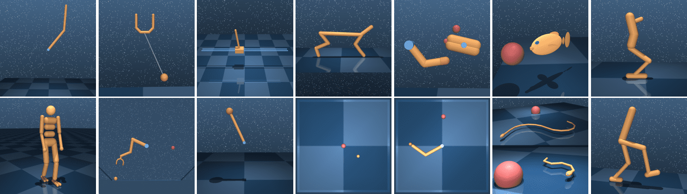        |
| [DeepMind Control Manipulation](https://github.com/google-deepmind/dm_control/tree/main/dm_control/manipulation) |    MuJoCo     | 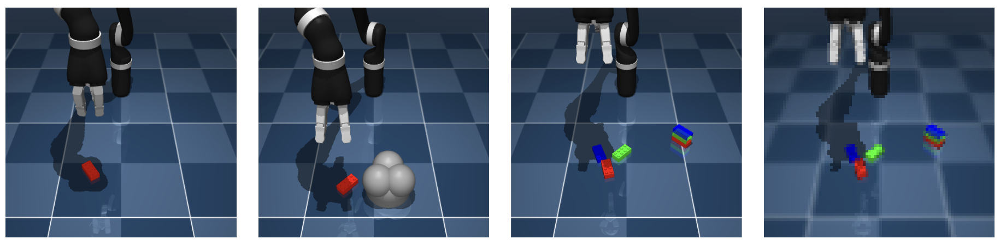 |
|                           [Meta-World](https://github.com/Farama-Foundation/Metaworld)                           |    MuJoCo     |                                  |
|                            [RoboSuite](https://github.com/ARISE-Initiative/robosuite)                            |    MuJoCo     |                  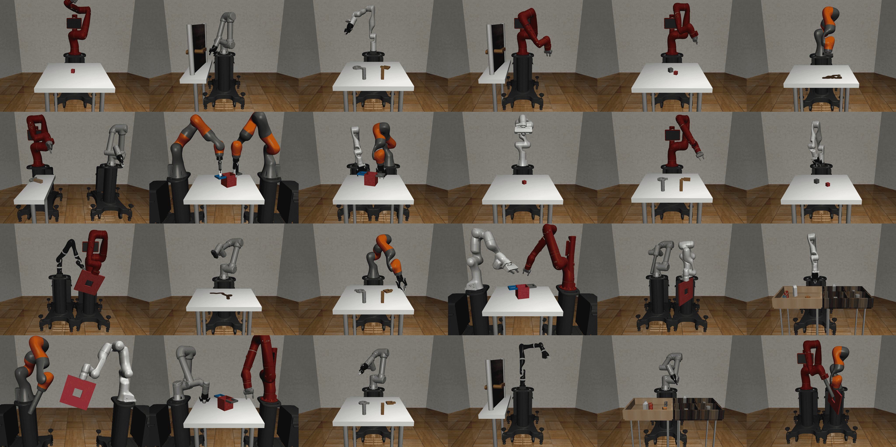                  |
|                           [LIBERO](https://github.com/Lifelong-Robot-Learning/LIBERO)                            |    MuJoCo     |                                          |
|                                [RoboHive](https://github.com/vikashplus/robohive)                                |    MuJoCo     |                   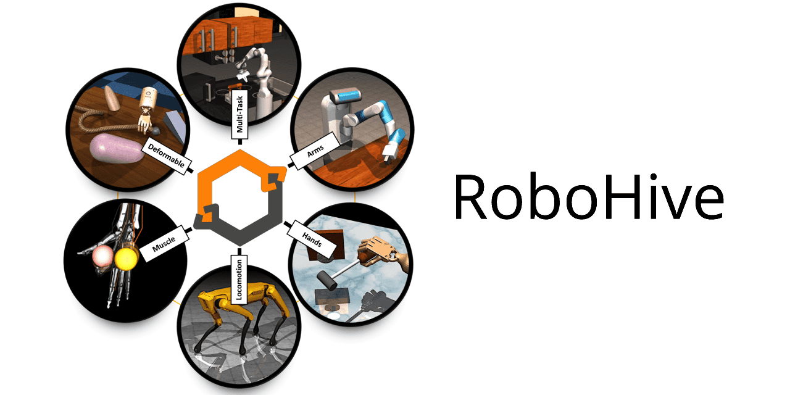                   |
|                        [Franka Kitchen](https://robotics.farama.org/envs/franka_kitchen/)                        |    MuJoCo     |             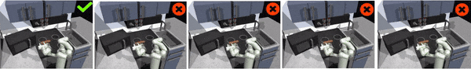             |
|                             [RoboDesk](https://github.com/google-research/robodesk)                              |    MuJoCo     |                   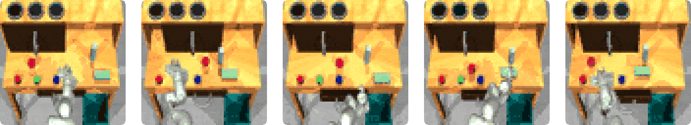                   |
|                        [HumanoidBench](https://github.com/carlosferrazza/humanoid-bench)                         |    MuJoCo     |             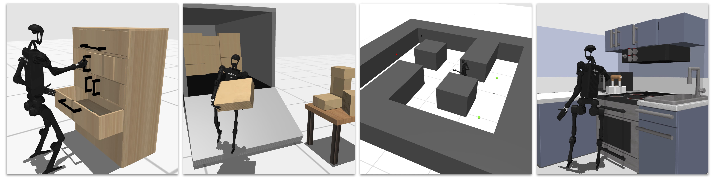             |
|                              [LocoMuJoCo](https://github.com/robfiras/loco-mujoco)                               |    MuJoCo     |                                  |
|                          [RoboPianist](https://github.com/google-research/robopianist)                           |    MuJoCo     |                                |
|                           [Adroit Hand](https://robotics.farama.org/envs/adroit_hand/)                           |    MuJoCo     |                  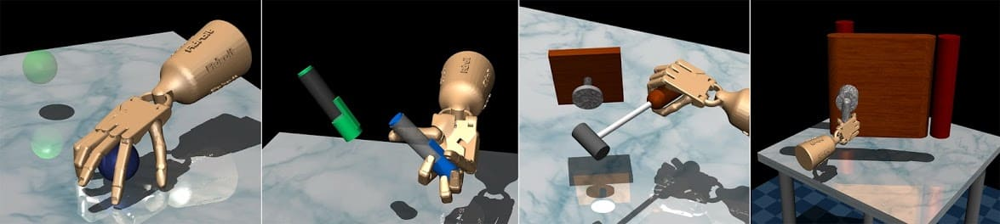                  |
|                                   [DexMV](https://github.com/yzqin/dexmv-sim)                                    |    MuJoCo     |                      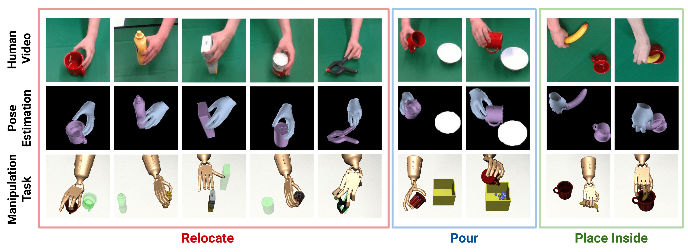                      |
|                                [ManiSkill](https://github.com/haosulab/ManiSkill)                                |    SAPIEN     |                 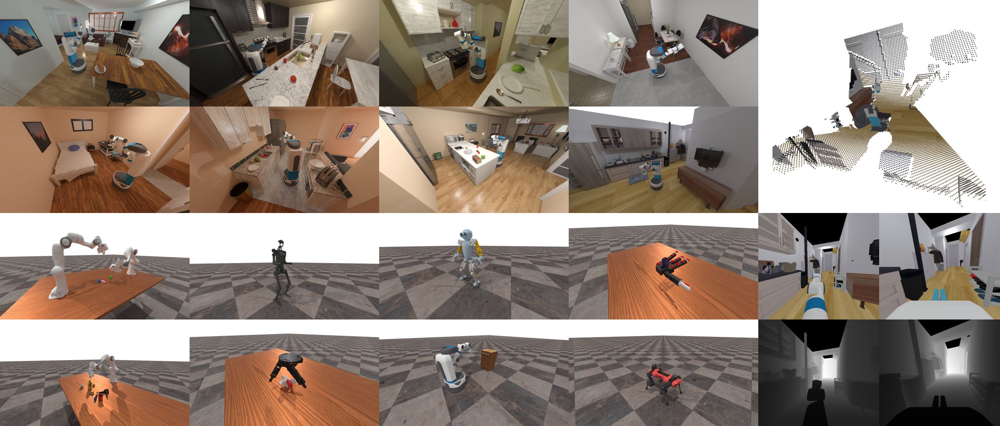                  |
|                              [DexArt](https://github.com/Kami-code/dexart-release)                               |    SAPIEN     |                     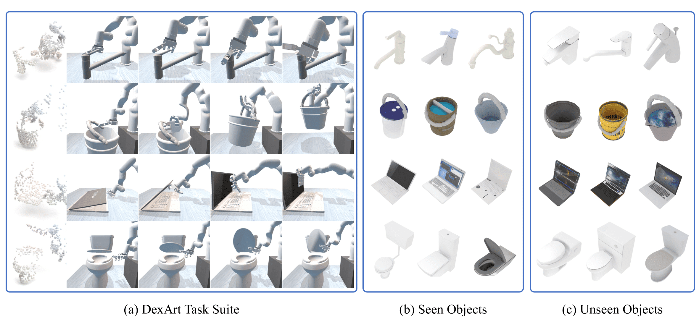                     |
|                                [DexDeform](https://github.com/sizhe-li/DexDeform)                                | PlasticineLab |                                    |
|                                  [RLBench](https://github.com/stepjam/RLBench)                                   |  CoppeliaSim  |                    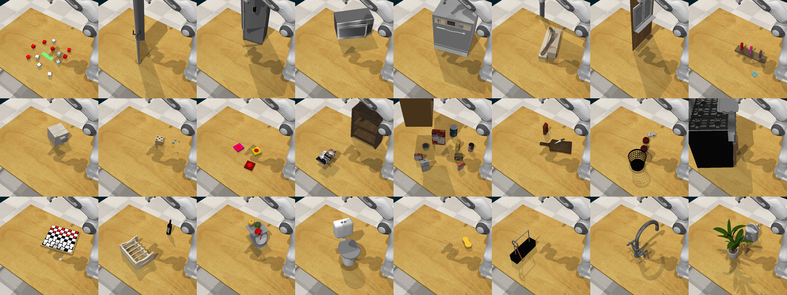                    |
|                      [Robot Colosseum](https://github.com/robot-colosseum/robot-colosseum)                       |  CoppeliaSim  |                        |
|                               [Ravens](https://github.com/google-research/ravens)                                |   PyBullet    |                                          |
|                                     [CALVIN](https://github.com/mees/calvin)                                     |   PyBullet    |                     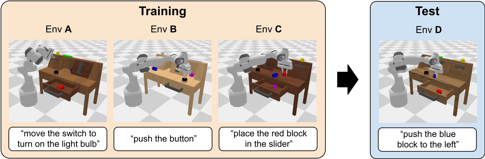                     |
|                               [VIMA-Bench](https://github.com/vimalabs/VIMABench)                                |   PyBullet    |                 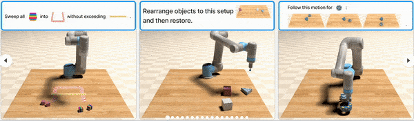                  |
|                               [Brax Control Suite](https://github.com/google/brax)                               |     Brax      |                       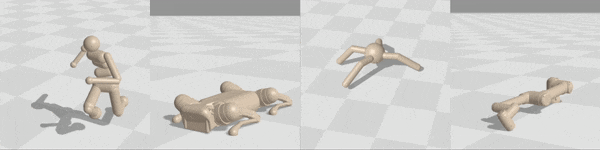                       |
|                          [NVIDIA Orbit Benchmark](https://isaac-orbit.github.io/orbit/)                          |   Isaac Sim   |                          |
|                          [TRANSIC-Envs](https://github.com/transic-robot/transic-envs)                           |   Isaac Gym   |               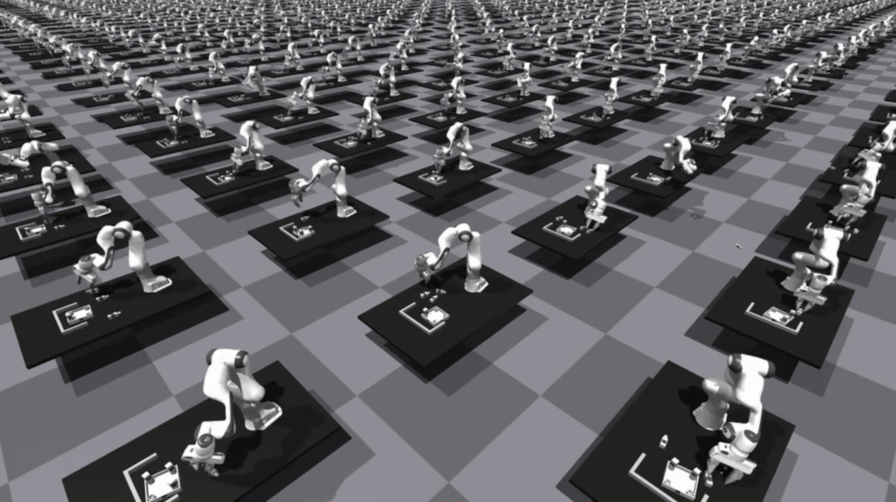               |
|                           [FurnitureBench](https://github.com/clvrai/furniture-bench)                            |   Isaac Gym   |            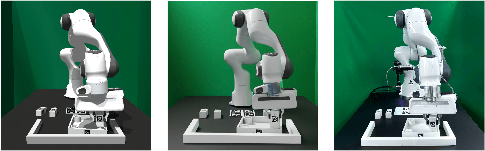             |
|                  [NVIDIA IsaacGym Benchmark](https://github.com/NVIDIA-Omniverse/IsaacGymEnvs)                   |   Isaac Gym   |          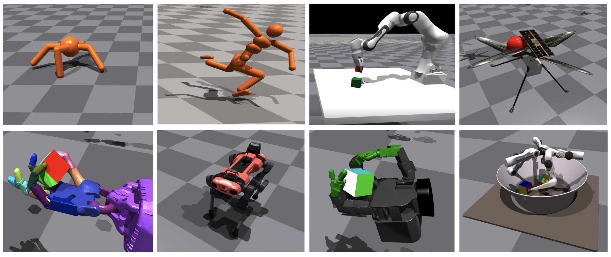           |
|                                      [PixMC](https://github.com/ir413/mvp)                                       |   Isaac Gym   |                      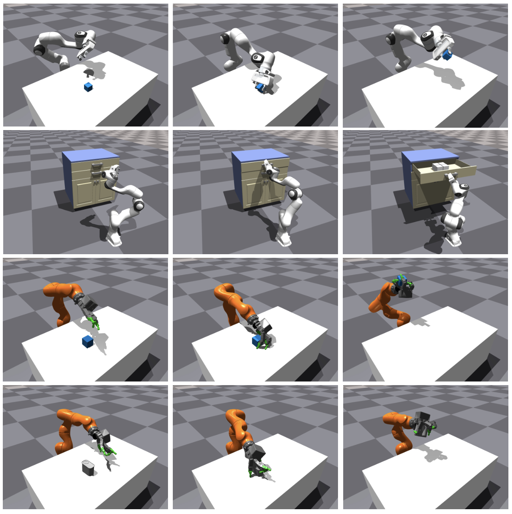                      |
|                                 [SoftGym](https://github.com/Xingyu-Lin/softgym)                                 |  NVIDIA FleX  |                                        |

## Notes

- Want to contribute? Make a Pull Request if you'd like to propose modifications/additions to this repository 🤗
- Choosing a benchmark? Keep in mind that some of these benchmarks share tasks ♻️
- Why reference this repository specifically? I will keep this repository up-to-date ✅
